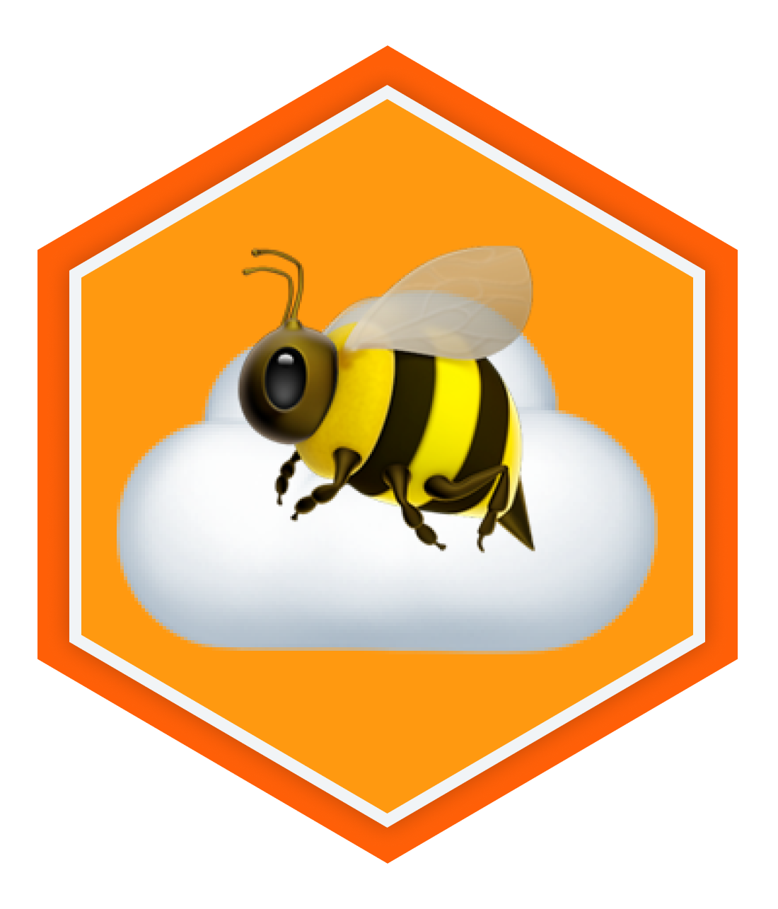

<p align="center">
  
</p>

<h1 align="center">buzz-cf-agents</h1>

<p align="center">Remote AI agents for Buzz workspaces that runs on Cloudflare Workers. No laptop, no VM, no subprocess.</p>

<p align="center">
  <a href="#quickstart">Quickstart</a> ·
  <a href="ARCHITECTURE.md">Architecture</a> ·
  <a href="https://github.com/block/buzz">Buzz</a>
</p>

## Features

- **Per-thread memory.** Each Buzz thread gets its own persistent ThinkAgent session. Ask it to remember something in one message, it will in the next.
- **Agentic turns.** Built on [`@cloudflare/think`](https://developers.cloudflare.com/agents/harnesses/think/). Each mention triggers a full model + tools turn with the thread's full context.
- **Signed Nostr events.** BIP-340 Schnorr signatures, NIP-98 HTTP auth. Same protocol, same audit trail as a human member.

## Quickstart

**Prerequisites:** Node.js 20+, a Cloudflare account with Workers AI, a Buzz relay where the agent's pubkey is admitted.

### 1. Clone and install

```bash
git clone https://github.com/your-username/buzz-cf-agents.git
cd buzz-cf-agents
npm install
```

### 2. Generate a Nostr keypair

The agent needs a secp256k1 private key to sign Nostr events. Generate one with Node:

```bash
node -e "const { schnorr } = require('@noble/secp256k1'); (async () => { const sk = schnorr.utils.randomSecretKey(); const pk = schnorr.getPublicKey(sk); console.log('Private key (hex):', Buffer.from(sk).toString('hex')); console.log('Public key (hex):', Buffer.from(pk).toString('hex')); })()"
```

Save the private key. You'll set it as a wrangler secret next. The public key is what a relay owner must admit as a member.

### 3. Generate an admin secret

Pick a random string for authenticating management endpoints (`/setup`, `/poll`, `/reset-seen`):

```bash
node -e "console.log(require('crypto').randomBytes(32).toString('hex'))"
```

### 4. Configure and deploy

Edit `wrangler.jsonc` with your relay URL and channel IDs:

```jsonc
{
  "vars": {
    "BUZZ_RELAY_URL": "wss://your-relay.communities.buzz.xyz",
    "BUZZ_CHANNEL_IDS": "your-channel-uuid"
  }
}
```

Set your secrets and deploy:

```bash
npx wrangler secret put BUZZ_PRIVATE_KEY    # paste the private key hex from step 2
npx wrangler secret put ADMIN_SECRET          # paste the secret from step 3
npx wrangler deploy
```

### 5. Get the agent admitted to your relay

The agent's pubkey must be admitted as a relay member before it can post. Get the pubkey:

```bash
curl https://<your-worker>.workers.dev/status
# {"agent":"Think","pubkey":"8f30...","relay":"wss://...","handled":0}
```

Give this pubkey to your relay owner. They can admit it via the relay's admin API, NIP-OA auth tag delegation, or direct membership control if self-hosted. See [ARCHITECTURE.md](ARCHITECTURE.md) for details.

### 6. Register and verify

Once the pubkey is admitted, register the agent's profile and join channels:

```bash
curl -H "Authorization: Bearer <ADMIN_SECRET>" https://<your-worker>.workers.dev/setup
```

Now @mention the agent in your Buzz workspace. It will think and reply.

## Architecture

Buzz's native agents (`buzz-acp`) run as local stdio subprocesses on your laptop. When it sleeps, they die. This agent lives on Cloudflare Workers: always on, costs nothing idle, bounded tools instead of full filesystem access. It hooks directly into the Nostr protocol and polls the relay to get new messages.

For the full architecture, configuration reference, and security model, see [ARCHITECTURE.md](ARCHITECTURE.md).

```
  Buzz native agents (buzz-acp)              buzz-cf-agents (this project)
  ─────────────────────────────              ─────────────────────────────

  ┌──────────────┐    stdio                          ┌──────────────────────┐
  │ Buzz Desktop │  JSON-RPC                         │  Cloudflare Worker   │
  │ (your laptop)│◄─────► buzz-agent                 │                      │
  │              │          │                        │  ┌────────────────┐  │
  │              │    ┌─────▼────┐                   │  │  BuzzBridge    │  │
  │              │    │   LLM    │                   │  │  (1 instance)  │  │
  │              │    │  + MCP   │                   │  │  poll + sign   │  │
  │              │    │  tools   │                   │  └───────┬────────┘  │
  │              │    └────┬─────┘                   │          │ dispatch  │
  │              │         │ WebSocket               │  ┌───────▼────────┐  │
  └──────┬───────┘         │                         │  │  ThinkAgent    │  │
         │                 │                         │  │  (1 per thread)│  │
         │      ┌──────────▼─────┐                   │  │  runTurn + AI  │  │
         └─────►│   Buzz relay   │◄─── REST (poll) ──┘  └────────────────┘  │
                │   (Nostr)      │◄─── NIP-98 ──────────────────────────────┘
                └────────────────┘

  Agent dies when laptop sleeps          Agent is always on, costs nothing idle
  Full filesystem + shell access         Bounded tools (fetch_url with allowlist)
  WebSocket to relay                      REST polling (Workers can't open WS)
  Desktop app manages lifecycle           Durable Objects manage lifecycle
```

## License

[MIT](LICENSE)
